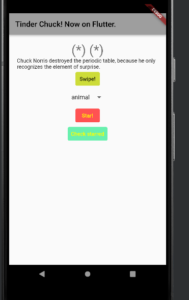
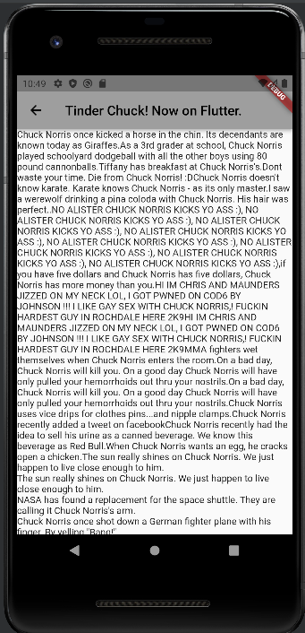

# tinder_chuck
For docs, see https://api.flutter.dev/flutter

# About
First part is done by clicking yellow "Swipe!" button. Thus, you'll see the new fresh joke.

Second part uses 3 more buttons:
* given list is a categories, available at source;
* red "Star!" marks the current joke as selected; 
* green "Check starred" allows you to jump on the page of all stored marked jokes, or "jokes".

// As you can easily guess, I'm not a designer.

No custom icon used - please, not for Tinder.
Screenshots of app's outlook are given below.

APK file is applied as [app-release.apk].
